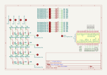
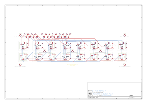
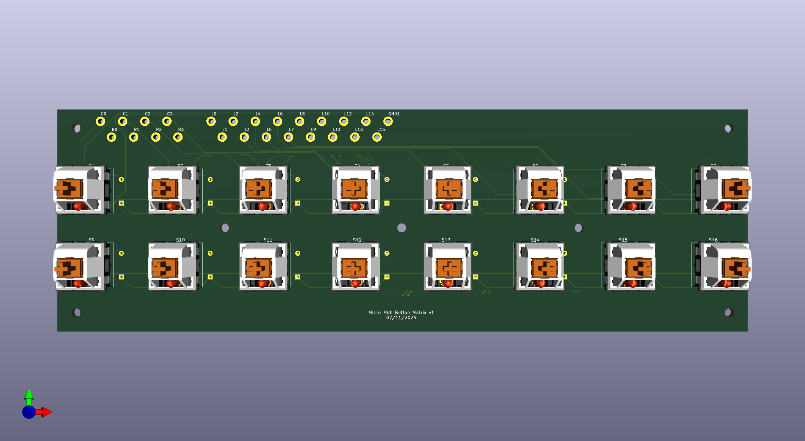
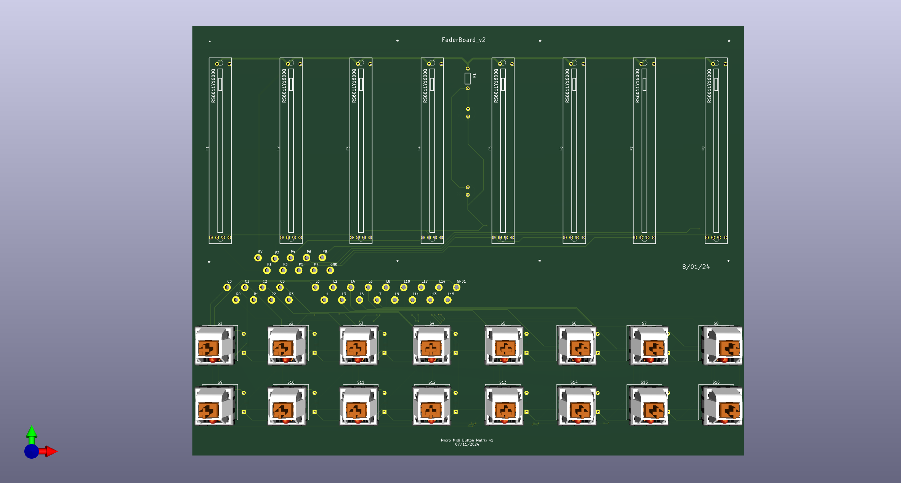

This repository contains the PCB for [micro-midi](https://github.com/RedOctober117/micro-midi).

## Dependencies
 - [scottokeebs](https://github.com/joe-scotto/scottokeebs)

## Examples

Outdated:
